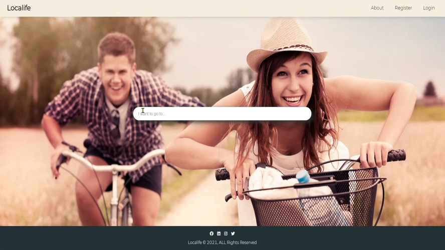

# Localife - your next local adventures

<!-- ALL-CONTRIBUTORS-BADGE:START - Do not remove or modify this section -->

<!-- ALL-CONTRIBUTORS-BADGE:END -->

> Frontend client files for the localife app. ([localife backend](https://github.com/geuxor/localife-backend)  )

 

Localife is an app that encourages you to explore the world by enjoying the life of a local!
It started with an idea of a scratch map and evolved into a good looking, smooth running and fun Web App.
Localife is made with React and Express and with the help of Postgres and Redis.

 

Once you're logged in (0Auth is coming next...), start searching by location and dates - you will discover many type of local experiences listed while visible in a map! You can select a map pin for more information and see the description of each experience. You can book by date and amount of people using Stripe Connect and see a list of bookings and (coming soon... start chatting with the provider). 

It's very easy to register as a provider, and you can start creating experiences in no-time. As a provider you decide the price, location and images.Travellers will soon be booking your experience and you can start sharing your daily activities, stories, common interests and favorite spots with the visitor. 

If you don't know where to go next, try the discovery button that will give you a variety of suggestions (comming next... )

 

## TLDR:

Checkout a video demo of the app on [YouTube](https://www.youtube.com/watch?v=):

## Table of contents

[localife backend](https://github.com/geuxor/localife-backend)  
[Tech Stack](#tech-stack)  
[Running localife](#running-localife)
[Running localife](#architecture)
[Observations](#observations)  
[Developers Team](#developers-team)  
[Contributors](#contributors-✨)

## Tech Stack

💖 [React]()\
💖 [Typescript](https://www.typescriptlang.org/)  
💖 [Redux](https://redux.js.org/)  
💖 [Express](https://expressjs.com/)  
💖 [PostgreSQL](https://www.postgresql.org/)  
💖 [Sequelize](https://sequelize.org/)  
💖 [Heroku](https://www.heroku.com/)  
💖 [Google Places API](https://cloud.google.com/maps-platform/places)

## Running localife

- Fork & clone this repo  
  Run `npm i` in localife directory  
  Adjust the necessary env variables to match your system. There's a .env.copy file to help you with this process.  
  (You will need an API key for the untappd and google places APIs)  
  Run `npm start`

- Fork & clone the [server repo](https://github.com/geuxor/localife-backend)  
  Make sure you have postgreSQL installed on your machine [mac](https://www.postgresql.org/download/macosx/) || [windows](https://www.postgresql.org/download/windows/)  
  Run `npm i` in localife-backend/server directory  
  Adjust the necessary env variables to match your system. There's a .env.copy file to help you with this process.
  Edit the ./config/config.json file with your database details.
  With the database running, run `npm run recreateDb`. This will generate the tables in the database and seed the data to get the project started.
  Run `npm start` in localife-backend/server directory
  
## Architecture

 

## Observations

##### Room for improvements

- Explore using a more global styling method
- Better typing for TypeScript
- Write tests

##### Next orders

- Deploy localife to the web
- Add chat system
- Add new cities
- Add more badges
- Create PWA 

## Developers Team

😋  German - [Github](https://github.com/geuxor) - [LinkedIn](https://www.linkedin.com/in/german-b)\
🤠  Seb - [Github](https://github.com/) - [LinkedIn](https://www.linkedin.com/)\
🥳  Maria - [Github](https://github.com/) - [LinkedIn](https://www.linkedin.com/)\
😂  Will - [Github](https://github.com/) - [LinkedIn](https://www.linkedin.com/)

## Contributors ✨

Thanks goes to these wonderful people ([💝 ](https://allcontributors.org/docs/en/emoji-key)):

<!-- ALL-CONTRIBUTORS-LIST:START - Do not remove or modify this section -->
<!-- prettier-ignore-start -->
<!-- markdownlint-disable -->
<table>
  <tr>
  <td align="center"><a href="http://www.linkedin.com/in/german-b">
    <b>German</b></a> 
   <a href="#infra-gexuor" title="Infrastructure (Hosting, Build-Tools, etc)">🚇</a> 
   <a href="https://github.com/geuxor/localife-frontend/commits?author=geuxor" title="Code">💻</a></td>

   <td align="center"><a href=""> <b>Seb</b></a> <a href="#infra-" title="Infrastructure (Hosting, Build-Tools, etc)">🚇</a> <a href="https://github.com/geuxor/localife-frontend/commits?author=" title="Code">💻</a></td>
   
   <td align="center"><a href=""> <b>Maria</b></a> <a href="#infra-" title="Infrastructure (Hosting, Build-Tools, etc)">🚇</a> <a href="https://github.com/geuxor/localife-frontend/commits?author=" title="Code">💻</a></td>
   
   <td align="center"><a href=""> <b>Will</b></a> <a href="#infra-" title="Infrastructure (Hosting, Build-Tools, etc)">🚇</a> <a href="https://github.com/geuxor/localife-frontend/commits?author=" title="Code">💻</a></td>
  
 </tr>
</table>

<!-- markdownlint-enable -->
<!-- prettier-ignore-end -->
<!-- ALL-CONTRIBUTORS-LIST:END -->

This project follows the [all-contributors](https://github.com/all-contributors/all-contributors) specification. Contributions of any kind welcome!

